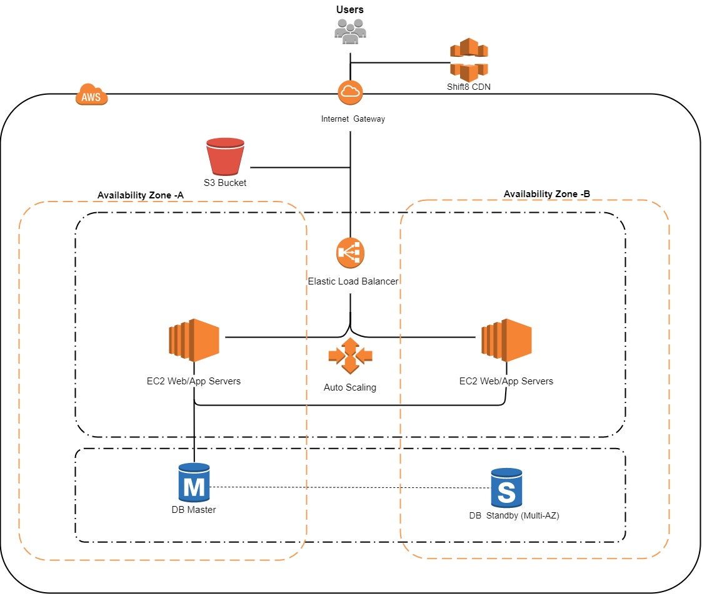

## Cloud-1

Using AWS to deploy a high-availability WordPress website with an external Amazon RDS 
database to Elastic Beanstalk

### Elastic Beanstalk

Elastic Beanstalk is an orchestration service offered by Amazon Web Services 
for deploying applications which orchestratesvarious AWS services, including EC2, 
RDS, autoscaling and elastic loadbalancers.

### Elastic Compute Cloud

EC2 is a web service that provides secure, resizable compute capacity 
in the cloud. It is designed to make web-scale cloud computing easier

### Autoscaling

Auto Scaling lets you set target utilization levels for multiple resources in a 
single, intuitive interface. You can quickly see the average utilization of all 
of your scalable resources without having to navigate to other consoles.

### Load balancer

Elastic Load Balancing automatically distributes incoming application traffic across 
multiple targets, such as Amazon EC2 instances.

### RDS

Relational Database Service is a web service that makes it easier to set up,
operate, and scale a relational database in the AWS Cloud. It provides cost-efficient,
resizable capacity for an industry-standard relational database and manages common
database administration tasks.

